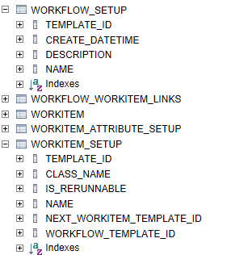
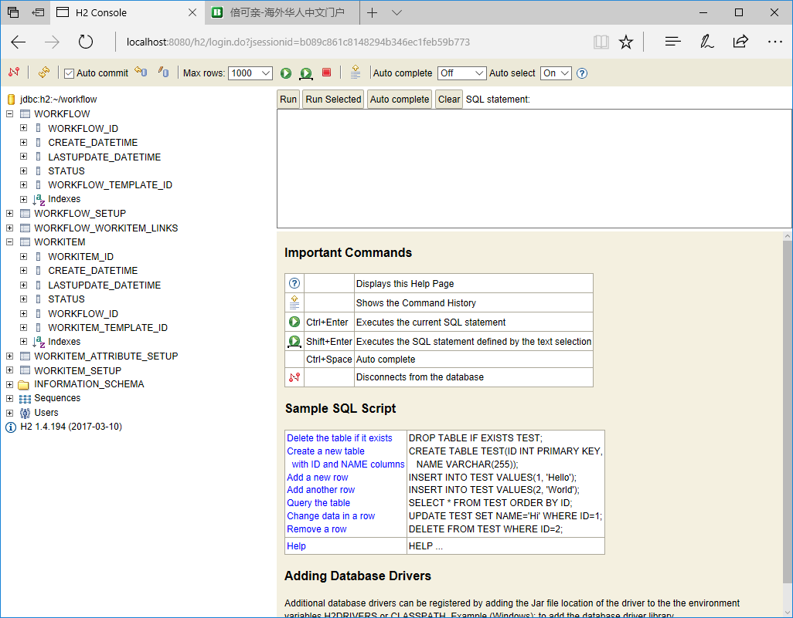

# Contact me
I know I am not good at documentation(maybe not good at coding too), so if you have any question, please drop me email: rong.shen@outlook.com

# Why we need another workflow?
Because I found current all workflow engine too complicated to use.

# Goal
Create a simple, easy-to-use, extendable workflow.

# Features of simple-workflow
*  Based on Spring Boots
*  Template based
*  Workflow driven by database
*  Async Event driven

# Template
User need to define workflow/workitem templates first. workflow template define
1. class name of each Workitem
2. sequence of workitem execution.

simple-workflow system will load the workflow template from database when it starts. When there is new start workflow request received, simple-workflow system will "instantiate" a corresponding workflow template and then start to proceed each workitem.

# Structure
## Workitem
Workitem is an action item. This is *__ONLY__* place user need to write the function. Example:

    public class SendDayOffRequestWI
    extends SimpleWorkitem<DayOffWorkflowEvent>{

    @Override
    public STATUS handleEvent(DayOffWorkflowEvent simpleWorkflowEvent, String errorMessage) {
      DayOffMessage message = simpleWorkflowEvent.getAttachecObject();

      if(getStatus() == STATUS.PENDING){
        validateData(message);
        saveData(message);
        return STATUS.COMPLETED;
      }
        return getStatus();
    }

    @Override
    public STATUS handleRejectEventOnStartedStatus(DayOffWorkflowEvent simpleWorkflowEvent) {
      return null;
    }

    @Override
    public void destroyWorkitem() {}
    }
This is the simple workitem, each workitem have to extend __SimpleWorkitem__ with genetic event(we will discuss this in event section).

User need to implements __handleEvent__, __handleRejectEventOnStartedStatus__ and __destroy__ methods.

* handleEvent() method
This is the main method that take care of the business. It has 3 parameters:

  1. WorkflowEvent: The is event object contain information in/out of workitem.

  2. errorMessage: error message for workitem to carry the message in/out of workitem.

* handleRejectEventOnStartedStatus() method
When workflow receive __reject__ request, workflow will do a roll call on each workitem, when workitem is *pending*, workflow will flip it to completed right away, if workitem is *completed* state, then nothing will happen, when workitem in *error* state, then workflow will flip it to completed state.

  Now, the issue is when workitem is in *inprogress* state. Workflow doesn't know how to set the state of workitem, this will leave to workitem. That is why __handleRejcteEventOnStartedStatus__ method. __Workitem can decide which state that need to set.__

* destroy() method
This is destructor of workitem. When Workflow received the reject request, workflow will call destory() method to clean up.

## Workflow
Workflow is a chain of workitems. Workflow actually can be looked as a linkedList. We support linear workflow (so it called simple-workflow), once the workflow start, it will call each workitem to proceed. when all the workitems return completed states, then workflow is in completed state. user can send reject workflow request to abandon the workflow process, but there is no guarantee that each workitem will stop process ASAP.

## Workflow Event
Workflow event is user defined events that can do 2 things:

1. Carry object to workflow manager to proceed.
2. Define specific event type that let specific workitem to handle.

You need to write your own event so you can attach whatever object and define whatever event type you need.
There is already some event types defined in workflow: __RUN_WORKFLOW__ and __REJECT_WORKFLOW__ event.
The workflow event is using Spring Aync Event.

# Data Structure
The simple-workflow is driven by database table, in the package, I only define the H2 in memory database, user need to persist to other database, then they can modify the code and add new data source.

2 tables:

1. workflow
2. workitem

workflow

# Walkthrough the Example

In the test package, I am using an employee request Day off workflow as example. This workflow is very very simple:

Employee Send DayOff Request  --> his Director Approve/Reject --> HR got record

The detail steps like following:

* Employee send day off request
* System capture it and save it. A new workflow created.
* System notify employee's Director that a new day off request received.
* The Director review and approve the request and send this information to System
* System will send the result to HR and HR will book the record.

So it has 3 workitems:

1. SendDayOffRequestWI
2. DirectivesApproveWI
3. HumanResourceWorkdaysBackupWI

The *SendDayOffRequestWI* receive __RUN_WORKFLOW__ event with some information like employee id, date etc, this is the start workitem. Once *SendDayOffRequestWI* did all these things it will turn into COMPLETED immediately.

The *DirectivesApproveWI* will be called when *SendDayOffRequestWI* is completed. It will send message to Director and then stop and wait: it need __REQUEST_APPROVED__ event to move from INPROGRESS to COMPLETED.

The *HumanResourceWorkdaysBackupWI* will be called when*DirectivesApproveWI* completed, it will take the day off message and record it.
